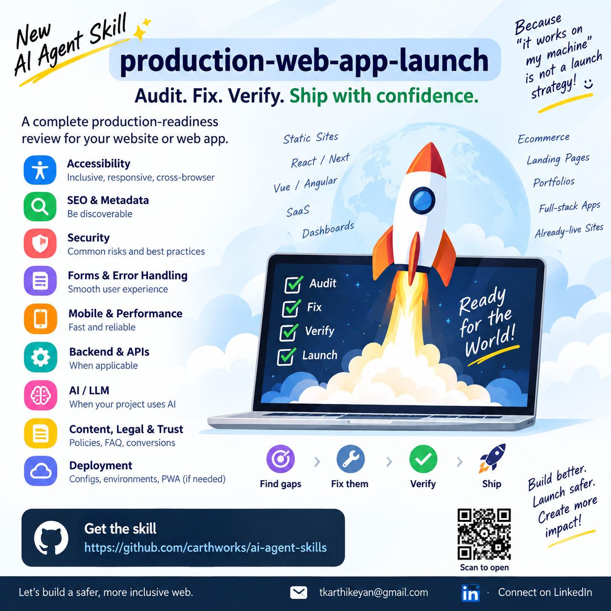

# ai-agent-skills (Developer Agent Stack)

> A curated collection of **Skills**, **Model Context Protocol (MCP)** servers, **Specialist Subagents**, **Behavioral Rules**, and **Composite Plugins** for [Antigravity IDE](https://antigravity.dev), Claude Desktop, Cursor, and modern AI coding agents.
> Drop skills into your workspace to teach your agent specialised workflows, plug in MCP servers for live runtime execution, assign subagents to domain tasks, and enforce strict behavioral guardrails.


[](https://carthworks.github.io/ai-agent-skills/)



---

## 🏛️ The 5 Pillars of the New Era Developer Stack

```
┌───────────────────────────────────────────────────────────────────────────────────┐
│                           DEVELOPER AGENT STACK                                   │
├─────────────────────────┬─────────────────────────┬───────────────────────────────┤
│ 1. 🧠 Skills            │ 2. 🔌 MCP Servers       │ 3. 🤖 Specialist Subagents    │
│ Step-by-step reasoning  │ Live runtime tools &    │ Role-based autonomous agents  │
│ playbooks & checklists  │ database/browser APIs   │ with scoped permissions       │
├─────────────────────────┴─────────────────────────┴───────────────────────────────┤
│ 4. 📜 Behavioral Rules & Guardrails    5. 📦 Composite Plugins & Stacks           │
│ Strict constraints, token efficiency   Pre-bundled fullstack suites combining     │
│ and clean architecture boundaries      Skills + MCPs + Subagents + Rules          │
└───────────────────────────────────────────────────────────────────────────────────┘
```

---

## 🧠 Skills Catalogue

| Skill | Category | Description |
|-------|----------|-------------|
| [production-web-app-launch](skills/web/production-web-app-launch/) | `web` | Audit and fix production-readiness gaps — accessibility, SEO, security, forms, mobile, deployment config. Activates on "is this ready to ship", "pre-launch check". |
| [web-trust-and-compliance](skills/web/web-trust-and-compliance/) | `web` | Audit legal compliance, privacy policies, terms & conditions, cancellation/refund policies, about & contact pages, pricing & support info, consent, and anti-dark-patterns. |
| [nextjs-performance](skills/web/nextjs-performance/) | `web` | Optimise Next.js for Core Web Vitals, bundle size, and perceived speed. Covers rendering strategy, `next/image`, fonts, code splitting, and App Router caching. |
| [api-design-rest](skills/web/api-design-rest/) | `web` | Design clean, consistent REST APIs — URL naming, HTTP methods, status codes, error shapes, versioning, pagination, and auth patterns. |
| [typescript-strict-mode](skills/typescript/typescript-strict-mode/) | `typescript` | Enforce TypeScript strict mode, eliminate `any`, use `unknown` + narrowing, discriminated unions, and utility types correctly. |
| [test-coverage-guidance](skills/testing/test-coverage-guidance/) | `testing` | Decide what to unit, integration, and E2E test. Covers testing pyramid, AAA pattern, async testing, coverage targets, and CI setup. |
| [git-commit-quality](skills/devops/git-commit-quality/) | `devops` | Enforce Conventional Commits. Blocks vague messages like "fix", "wip", "update". Generates well-formed commit messages with correct type, scope, and body. |
| [code-review-checklist](skills/devops/code-review-checklist/) | `devops` | Structured PR review across correctness, security, performance, tests, and maintainability. Produces BLOCKER / MAJOR / MINOR findings with fixes. |
| [dockerfile-best-practices](skills/devops/dockerfile-best-practices/) | `devops` | Write secure, minimal Dockerfiles — multi-stage builds, non-root user, layer caching, `.dockerignore`, and production docker-compose patterns. |
| [env-secret-safety](skills/safety/env-secret-safety/) | `safety` | Prevent hardcoded secrets and API keys. Detects credential patterns, enforces `.env` hygiene, and guides safe secret storage across all cloud providers. |

---

## 🔌 Model Context Protocol (MCP) Catalogue

| Server | Category | Command / Runtime | Description |
|---|---|---|---|
| [github](mcps/planning/github/mcp.json) | `planning` | `npx @modelcontextprotocol/server-github` | Search code, manage pull requests, create/update issues and inspect commits. |
| [linear](mcps/planning/linear/mcp.json) | `planning` | `npx linear-mcp-server` | Query, create, and update Linear issues, search project roadmaps and sprints. |
| [chrome-devtools](mcps/browser/chrome-devtools/mcp.json) | `browser` | `npx chrome-devtools-mcp` | Inspect live DOM, capture network logs, take screenshots, troubleshoot UI console errors. |
| [playwright](mcps/browser/playwright/mcp.json) | `browser` | `npx @modelcontextprotocol/server-puppeteer` | Headless browser automation, end-to-end clicks, form fills, multi-page flows. |
| [postgres](mcps/data/postgres/mcp.json) | `data` | `npx @modelcontextprotocol/server-postgres` | Inspect database schemas, table definitions, foreign keys, and run queries without hallucinations. |
| [supabase](mcps/data/supabase/mcp.json) | `data` | `npx @supabase/mcp-server` | Manage Supabase Postgres tables, Auth users, Storage buckets, and Edge Functions. |
| [redis](mcps/data/redis/mcp.json) | `data` | `npx @modelcontextprotocol/server-redis` | Query cache keys, inspect TTLs, view data types (hashes/sets/streams), debug caching. |
| [fetch](mcps/api/fetch/mcp.json) | `api` | `uvx mcp-server-fetch` | Fetch web content, test REST and GraphQL endpoints, download API schemas. |
| [stripe](mcps/api/stripe/mcp.json) | `api` | `npx @stripe/mcp` | Inspect Stripe test-mode charges, customers, subscriptions, and verify webhooks. |
| [docker](mcps/devops/docker/mcp.json) | `devops` | `npx @modelcontextprotocol/server-docker` | Inspect containers, images, volumes, and tail live logs in docker-compose. |
| [cloudflare](mcps/devops/cloudflare/mcp.json) | `devops` | `npx @cloudflare/mcp-server-cloudflare` | Inspect DNS records, Workers, KV namespaces, D1 databases, and R2 storage buckets. |
| [sentry](mcps/quality/sentry/mcp.json) | `quality` | `uvx mcp-server-sentry` | Retrieve live stack traces, crash reports, error breadcrumbs, and issue telemetry. |

---

## 🤖 Specialist Subagents Catalogue

Specialist agent personas configured with domain-specific reasoning and tool permissions:

| Subagent | Category | Role | Description |
|---|---|---|---|
| [security-auditor](agents/security-auditor/) | `security` | Senior Security & Vulnerability Auditor | Scans for OWASP Top 10 vulnerabilities, hardcoded secrets, injection flaws, and unsafe dependencies. |
| [code-reviewer](agents/code-reviewer/) | `review` | Principal Code Reviewer & Architecture Guardian | Enforces correctness, strict typing, error handling, performance regressions, and architectural boundaries. |
| [qa-engineer](agents/qa-engineer/) | `quality` | Staff QA & Test Automation Specialist | Designs test pyramid plans, edge-case generation, synthetic regression testing, and E2E test suites. |

---

## 📜 Behavioral Rules & Guardrails Catalogue

Universal rule presets ready to drop into `.instructions`, `AGENTS.md`, or `.cursorrules`:

| Rule Preset | Category | Description |
|---|---|---|
| [token-efficiency](rules/token-efficiency.md) | `efficiency` | Minimizes token consumption, enforces surgical diffs, avoids redundant reads, and streamlines responses. |
| [typescript-strict-guardrails](rules/typescript-strict-guardrails.md) | `quality` | Enforces zero `any` policy, discriminated unions, runtime Zod boundary validation, and exhaustive typing. |
| [clean-architecture-boundaries](rules/clean-architecture-boundaries.md) | `architecture` | Enforces strict separation of UI presentation, domain business logic, and infrastructure/data access layers. |
| [security-and-secret-hygiene](rules/security-and-secret-hygiene.md) | `security` | Prohibits hardcoded credentials, enforces `.env` validation, and prevents client-side secret exposure. |

---

## 📦 Composite Plugins & Bundles Catalogue

Pre-configured fullstack bundles combining Skills, MCPs, Subagents, and Rules:

| Plugin Bundle | Category | Key Components | Description |
|---|---|---|---|
| [web-security-pack](plugins/web-security-pack/) | `security` | Skills: `web-trust-and-compliance`, `env-secret-safety`<br>MCP: `sentry`<br>Agent: `security-auditor`<br>Rule: `security-and-secret-hygiene.md` | Defense-in-depth web application security suite. |
| [production-launch-pack](plugins/production-launch-pack/) | `launch` | Skills: `production-web-app-launch`, `web-trust-and-compliance`, `nextjs-performance`<br>MCPs: `cloudflare`, `chrome-devtools`<br>Agent: `qa-engineer`<br>Rule: `token-efficiency.md` | Comprehensive pre-launch and edge deployment verification stack. |
| [fullstack-quality-pack](plugins/fullstack-quality-pack/) | `quality` | Skills: `typescript-strict-mode`, `test-coverage-guidance`, `code-review-checklist`<br>MCP: `sentry`<br>Agent: `code-reviewer`<br>Rules: `typescript-strict-guardrails.md`, `clean-architecture-boundaries.md` | Fullstack code quality, testing pyramid, and PR review bundle. |

---

## 🚀 Quick Install & Project Layout

### Installation Options

#### Option A — Direct Copy
```bash
# Skills
cp -r skills/web/production-web-app-launch .agents/skills/

# Subagents
cp -r agents/security-auditor .agents/agents/

# Rules
cp rules/token-efficiency.md .agents/rules/

# Plugins
cp -r plugins/web-security-pack .agents/plugins/
```

#### Option B — One-liner Install Script
- **macOS / Linux**: `bash -c "$(curl -fsSL https://raw.githubusercontent.com/carthworks/ai-agent-skills/main/scripts/install.sh)"`
- **Windows (PowerShell)**: `irm https://raw.githubusercontent.com/carthworks/ai-agent-skills/main/scripts/install.ps1 | iex`

### Workspace Layout (`.agents/`)
```
your-project/
└── .agents/
    ├── skills/       ← Drop SKILL.md folders here
    ├── agents/       ← Drop specialist subagent folders here
    ├── rules/        ← Drop behavioral rule presets here
    ├── plugins/      ← Drop composite plugin bundles here
    └── mcp_config.json ← Configure MCP servers here
```

---

## Contributing & Validation

Run local validation across the entire stack:
```bash
npm test          # Runs all validation test suites
npm run generate  # Re-generates catalogue JSON files & synchronizes docs/index.html
```

See [CONTRIBUTING.md](CONTRIBUTING.md) for details.

---

## License

Apache-2.0 — see [LICENSE](LICENSE).

---

## Author

**Karthikeyan T** · [@carthworks](https://github.com/carthworks)
- ✉️ [tkarthikeyan@gmail.com](mailto:tkarthikeyan@gmail.com)
- 💼 [Connect on LinkedIn](https://www.linkedin.com/in/carthworks)
- 🐙 [github.com/carthworks](https://github.com/carthworks)

> *Supercharging the next generation of software engineering.*
